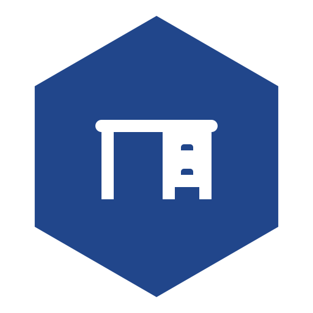
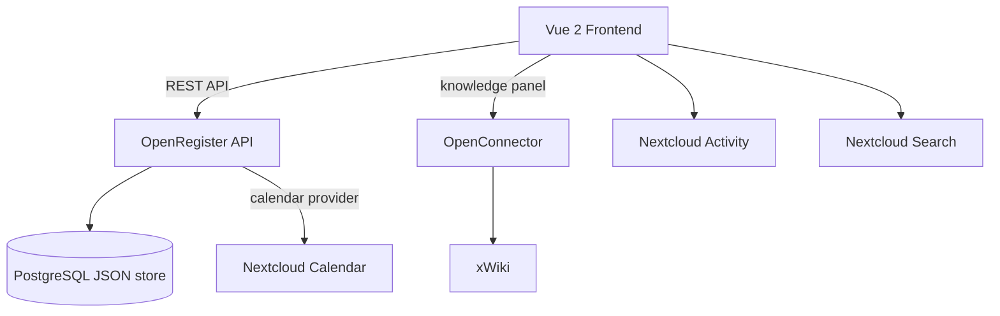

<p align="center">
  
</p>

<h1 align="center">DeskDesk</h1>

<p align="center">
  <strong>Flexible desk booking for open-office environments</strong>
</p>

<p align="center">
  <a href="https://github.com/ConductionNL/deskdesk/releases"></a>
  <a href="https://github.com/ConductionNL/deskdesk/blob/main/LICENSE"></a>
  <a href="https://github.com/ConductionNL/deskdesk/actions"></a>
</p>

---

Pick a desk on a floor, book a slot, sync it to your calendar, and read the booking how-tos from the company wiki — without leaving Nextcloud.

DeskDesk is also the **reference app for the Conduction Nextcloud stack**: it demonstrates schema-driven objects, the manifest pattern, stacked detail/index views, and schema-driven integrations with Nextcloud Calendar and xWiki. Built with [@conduction/nextcloud-vue](https://github.com/ConductionNL/nextcloud-vue) on top of [OpenRegister](https://github.com/ConductionNL/openregister).

> **Pre-wired for [OpenRegister](https://github.com/ConductionNL/openregister)** — all data (desks, bookings, zones) is stored as OpenRegister objects. OpenRegister must be installed first. The Calendar sync and the per-desk knowledge panel also need [OpenConnector](https://github.com/ConductionNL/openconnector) and a Nextcloud Calendar app.

## Screenshots

_Add screenshots here once the UI stabilises._

## Features

Features are defined in [`openspec/specs/`](openspec/specs/). See the [roadmap](openspec/ROADMAP.md) for planned work.

### Core
- **Desk catalogue** — Browse desks by floor, zone, equipment, and accessibility
- **Booking** — Reserve a slot, with optional recurrence
- **Dashboard** — Occupancy at a glance, your upcoming bookings, and popular zones
- **Admin Settings** — Configurable settings panel for administrators

### Integrations
- **Calendar sync** — Bookings appear in Nextcloud Calendar via the OpenRegister calendar provider
- **Contextual knowledge** — "How does this work?" articles surface per desk via OpenConnector + xWiki
- **OpenRegister data layer** — Desks, bookings, zones, and floors as OpenRegister objects

### Supporting
- **Quality Pipeline** — PHPCS, PHPMD, Psalm, PHPStan, ESLint, Stylelint

## Architecture



_Update this diagram during `/app-explore` sessions as the architecture evolves._

### Data Model

| Object | Description |
|--------|-------------|
| Desk | A bookable desk — floor, zone, equipment, accessibility attributes |
| Booking | A reservation of a desk for a person and a time slot (optionally recurring) |
| Zone | A grouping of desks within a floor (e.g. "quiet", "team space") |
| Floor | A floor / building level that contains zones and desks |

_The data model is defined as OpenRegister schemas — see [`openspec/schemas/`](openspec/schemas/). Feature-level design lives in [`openspec/specs/`](openspec/specs/); architectural decisions in [`openspec/architecture/`](openspec/architecture/)._

### Directory Structure

```
deskdesk/
├── appinfo/                       # Nextcloud app manifest, routes, navigation
├── lib/                           # PHP backend
│   ├── AppInfo/Application.php
│   ├── Controller/                # Dashboard, Health, Item, Metrics, Settings
│   ├── Service/                   # ItemService, SettingsService
│   ├── Listener/DeepLinkRegistrationListener.php
│   ├── Repair/InitializeSettings.php
│   ├── Sections/SettingsSection.php
│   └── Settings/AdminSettings.php
├── templates/                     # PHP templates (SPA shells)
├── src/                           # Vue 2 frontend
│   ├── main.js                    # App entry point
│   ├── App.vue                    # Root component
│   ├── router/index.js            # Vue Router
│   ├── store/                     # Pinia stores (object, settings)
│   └── views/                     # IndexPageWrapper, DetailPageWrapper, KnowledgeTab, settings/
├── openspec/                      # Specifications, schemas, decisions, and roadmap
│   ├── app-config.json            # Canonical app config (id, goal, dependencies, CI)
│   ├── config.yaml                # OpenSpec CLI configuration
│   ├── schemas/                   # OpenRegister schemas
│   ├── specs/                     # Feature specs (input for OpenSpec changes)
│   ├── architecture/              # App-specific Architectural Decision Records
│   ├── ROADMAP.md                 # Product roadmap
│   └── changes/                   # OpenSpec change directories (created on first change)
├── docs/                          # Feature and standards documentation
├── tests/                         # Unit and integration tests
├── l10n/                          # Translations (en, nl)
├── .github/workflows/             # CI/CD pipelines
├── Makefile                       # Dev helpers (make dev-link)
└── img/                           # App icons and screenshots
```

## Requirements

| Dependency | Version |
|-----------|---------|
| Nextcloud | 28 – 33 |
| PHP | 8.1+ |
| Node.js | 20+ |
| [OpenRegister](https://github.com/ConductionNL/openregister) | latest |
| [OpenConnector](https://github.com/ConductionNL/openconnector) | latest (for the per-desk knowledge panel) |
| Nextcloud Calendar | optional (for booking → calendar sync) |

## Installation

### From the Nextcloud App Store

1. Go to **Apps** in your Nextcloud instance
2. Search for **DeskDesk**
3. Click **Download and enable**

> OpenRegister must be installed first. [Install OpenRegister →](https://apps.nextcloud.com/apps/openregister)

### From Source

```bash
cd /var/www/html/custom_apps
git clone https://github.com/ConductionNL/deskdesk.git deskdesk
cd deskdesk
npm install && npm run build
php occ app:enable deskdesk
```

## Development

### Start the environment

```bash
docker compose -f ../openregister/docker-compose.yml up -d
```

### Frontend development

```bash
npm install
npm run dev        # Watch mode
npm run build      # Production build
```

### Code quality

```bash
# PHP
composer check:strict   # All quality checks (PHPCS, PHPMD, Psalm, PHPStan, tests)
composer cs:fix         # Auto-fix PHPCS issues
composer phpmd          # Mess detection
composer phpmetrics     # HTML metrics report

# Frontend
npm run lint            # ESLint
npm run stylelint       # CSS linting
```

### Enable locally

Nextcloud requires the app directory name to match the `<id>` in `appinfo/info.xml` (`deskdesk`).

> **Note:** The `js/` build output is not committed. You must build the frontend before enabling the app, or the UI will be blank.

```bash
make dev-link
npm install && npm run build
docker exec nextcloud php occ app:enable deskdesk
```

## Tech Stack

| Layer | Technology |
|-------|-----------|
| Frontend | Vue 2.7, Pinia, @nextcloud/vue |
| Build | Webpack 5, @nextcloud/webpack-vue-config |
| Backend | PHP 8.1+, Nextcloud App Framework |
| Data | OpenRegister (PostgreSQL JSON objects) |
| UX | @conduction/nextcloud-vue |
| Integrations | Nextcloud Calendar (OpenRegister calendar provider), xWiki (via OpenConnector) |
| Quality | PHPCS, PHPMD, Psalm, PHPStan, ESLint, Stylelint |

## Branches

| Branch | Purpose |
|--------|---------|
| `main` | Stable releases — triggers release workflow |
| `beta` | Beta / pre-release builds |
| `development` | Active development — merge target for feature branches |

## Documentation

| Resource | Description |
|----------|-------------|
| [`docs/`](docs/) | Feature and standards documentation |
| [`openspec/app-config.json`](openspec/app-config.json) | App identity, goals, dependencies, and CI configuration |
| [`openspec/schemas/`](openspec/schemas/) | OpenRegister schemas — the data model |
| [`openspec/specs/`](openspec/specs/) | Feature specs — what the app should do |
| [`openspec/architecture/`](openspec/architecture/) | App-specific Architectural Decision Records |
| [`openspec/ROADMAP.md`](openspec/ROADMAP.md) | Product roadmap |
| [`openspec/`](openspec/) | Implementation specifications and changes |

## Standards & Compliance

- **Accessibility:** WCAG AA (Dutch government requirement)
- **Authorization:** RBAC via OpenRegister
- **Audit trail:** Full change history on all objects
- **Localization:** English and Dutch

## Related Apps

- **[OpenRegister](https://github.com/ConductionNL/openregister)** — Object storage layer (required dependency)
- **[OpenConnector](https://github.com/ConductionNL/openconnector)** — Powers the contextual per-desk knowledge panel (xWiki integration)
- **Nextcloud Calendar** — Bookings sync here via the OpenRegister calendar provider

## Troubleshooting

### App UI is blank after enabling

The `js/` build output is not committed to the repo. Run the frontend build before enabling the app:

```bash
npm install && npm run build
```

### "Could not download app deskdesk" when running `occ app:enable`

Nextcloud requires the app directory name to exactly match the `<id>` in `appinfo/info.xml` (`deskdesk`). If you cloned the repo under a different name, create a symlink first:

```bash
make dev-link   # creates apps-extra/deskdesk -> <clone dir>
```

Then enable the app again:

```bash
docker exec nextcloud php occ app:enable deskdesk
```

### Bookings don't appear in Calendar

The calendar sync runs through the OpenRegister calendar provider — make sure OpenRegister is installed and enabled, and that a Nextcloud Calendar app is present.

### The per-desk knowledge panel is empty

Knowledge articles are pulled via OpenConnector from xWiki. Check that OpenConnector is installed and that the xWiki source is configured.

## Support

For support, contact us at [support@conduction.nl](mailto:support@conduction.nl).

For a Service Level Agreement (SLA), contact [sales@conduction.nl](mailto:sales@conduction.nl).

## License

This project is licensed under the [EUPL-1.2](LICENSE).

### Dependency license policy

All dependencies (PHP and JavaScript) are automatically checked against an approved license allowlist during CI. The following SPDX license families are approved:

- **Permissive:** MIT, ISC, BSD-2-Clause, BSD-3-Clause, 0BSD, Apache-2.0, Unlicense, CC0-1.0, CC-BY-3.0, CC-BY-4.0, Zlib, BlueOak-1.0.0, Artistic-2.0, BSL-1.0
- **Copyleft (EUPL-compatible):** LGPL-2.0/2.1/3.0, GPL-2.0/3.0, AGPL-3.0, EUPL-1.1/1.2, MPL-2.0
- **Font licenses:** OFL-1.0, OFL-1.1

## Authors

Built by [Conduction](https://conduction.nl) — open-source software for Dutch government and public sector organizations.
